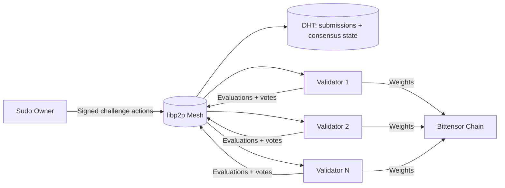

<div align="center">

# ρlατfοrm

**Distributed validator network for decentralized AI evaluation on Bittensor**

[](https://github.com/PlatformNetwork/platform/actions/workflows/ci.yml)
[](https://github.com/PlatformNetwork/platform/actions)
[](https://github.com/PlatformNetwork/platform/blob/main/LICENSE)
[](https://github.com/PlatformNetwork/platform/stargazers)
[](https://www.rust-lang.org/)


</div>

---

## Introduction

Platform is a **WASM-first, peer-to-peer validator network** that evaluates miner submissions for Bittensor challenges. Validators run deterministic WASM runtimes in production, reach consensus over libp2p, and submit stake-weighted results to the chain. Docker is reserved for local and CI test harnesses only.

**Key properties**
- Fully decentralized P2P network (libp2p gossipsub + DHT)
- Stake-weighted PBFT-style consensus for challenge state
- WASM-first challenge execution with strict resource limits
- Deterministic scoring and transparent weight submission

**Documentation index**
- [Architecture](docs/architecture.md)
- [Validator Operations](docs/operations/validator.md)
- [Security Model](docs/security.md)
- [Challenges](docs/challenges.md)
- [Challenge Integration Guide](docs/challenge-integration.md)

---

## Network Overview



---

## Quick Start (Validator)

```bash
git clone https://github.com/PlatformNetwork/platform.git
cd platform
cp .env.example .env
# Edit .env: add your VALIDATOR_SECRET_KEY (BIP39 mnemonic)
mkdir -p data
cargo build --release --bin validator-node
./target/release/validator-node --data-dir ./data --secret-key "${VALIDATOR_SECRET_KEY}"
```

See [Validator Operations](docs/operations/validator.md) for full requirements, configuration, and monitoring.

---

## Architecture

Platform coordinates validators over libp2p and anchors finalized weights to Bittensor. Detailed flows are documented in [docs/architecture.md](docs/architecture.md), including consensus and data storage.

---

## Operations

- **Production**: WASM runtime only, no Docker dependency.
- **Testing**: Docker is used exclusively for integration harnesses (`./scripts/test-comprehensive.sh`).

See [docs/operations/validator.md](docs/operations/validator.md) for deployment guidance.

---

## Security

Platform enforces stake-weighted admission, signed P2P messages, and a hardened runtime policy for challenges. See [docs/security.md](docs/security.md) for the full security model and runtime isolation diagram.

---

## Challenges

Challenges are WASM modules that define evaluation logic. The lifecycle, registration flow, and runtime constraints are covered in [docs/challenges.md](docs/challenges.md).

---

## License

MIT
