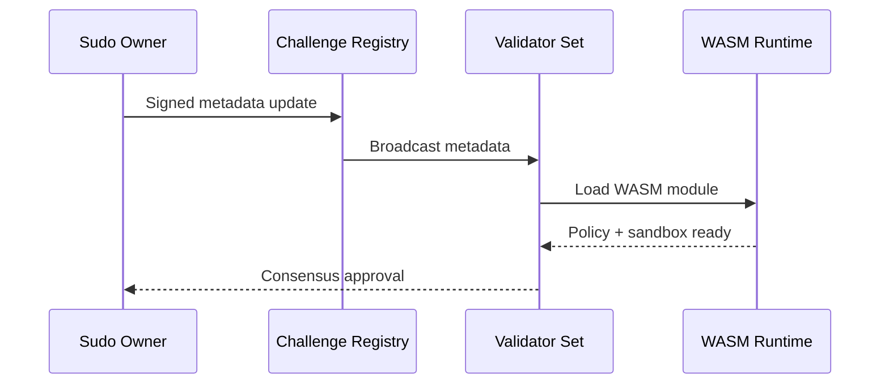

# Platform Challenge Crates

This directory contains challenge crates that integrate with the Platform validator network. Production execution is **WASM-first**; Docker is reserved for test harnesses only.

## Directory Structure

```
challenges/
├── README.md           # This file
├── term-challenge/     # Terminal benchmark challenge (WASM)
└── [your-challenge]/   # Your custom challenge crate
```

## Challenge Lifecycle



## Adding a New Challenge Crate

1. Create your challenge crate in this directory or reference it as a git dependency.
2. Implement the `ServerChallenge` trait from `platform-challenge-sdk`.
3. Register your challenge metadata via the challenge registry flow.
4. Update the workspace `Cargo.toml` if adding locally.

## Challenge Crate Requirements

- Must implement `platform-challenge-sdk::ServerChallenge`.
- Must provide `/evaluate` HTTP endpoint.
- Must handle graceful shutdown signals.
- Must support state persistence for hot-reload.
- Must produce deterministic results for consensus.

## Build the WASM Artifact

```bash
cargo build --release --target wasm32-unknown-unknown
```

## Test Harness (Docker Optional)

Docker is optional and used only for integration testing. Use the comprehensive test harness if you need Docker-backed evaluations:

```bash
./scripts/test-comprehensive.sh
```

## External Challenge Crates

Challenge crates can also live in external repositories. They should:

- Import `platform-challenge-sdk` as a dependency.
- Implement the `ServerChallenge` trait.
- Publish a WASM artifact for production use.
- Optionally include Docker config for local/CI tests only.

## Documentation

- [Challenge Integration Guide](../docs/challenge-integration.md)
- [Challenges](../docs/challenges.md)
- [Architecture](../docs/architecture.md)
