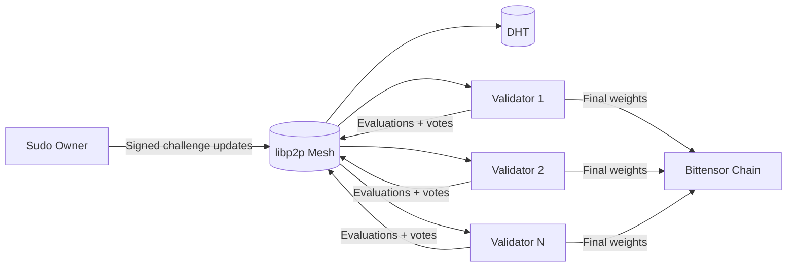
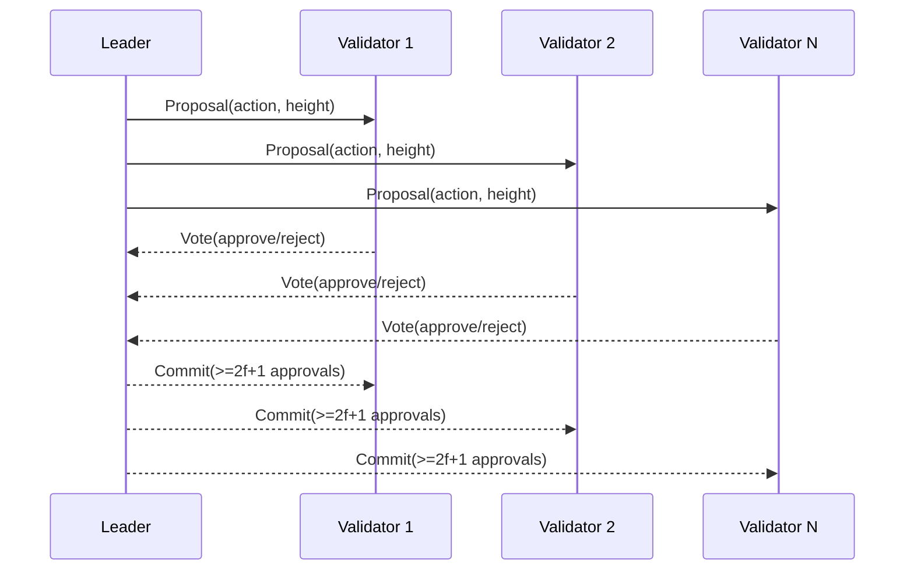
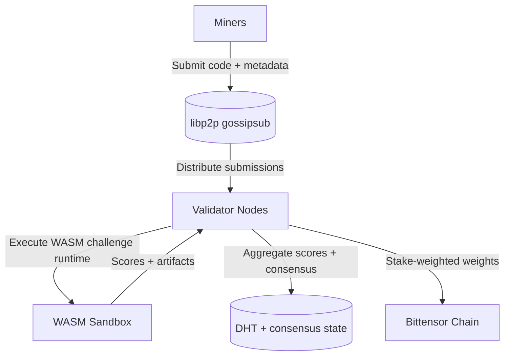

# Architecture

Platform is a **WASM-first, P2P validator network** designed for deterministic challenge evaluation on Bittensor. Validators exchange submissions, evaluation results, and consensus votes directly over libp2p, then submit finalized weights to the chain.

## Core Components

- **Validator Node (`validator-node`)**: runs P2P, consensus, and evaluation pipelines.
- **Challenge Registry**: signed metadata for active challenges (WASM modules + policies).
- **WASM Runtime Interface**: strict sandbox with resource caps and audited host functions.
- **P2P Consensus Engine**: PBFT-style voting with stake-weighted validator set.
- **Distributed Storage (DHT)**: shared submission and consensus state.

## Network Topology (P2P)

## Consensus Flow (PBFT-style)

## Data Flow

## Storage Model

- **DHT entries**: submissions, evaluation results, consensus checkpoints.
- **Local persistence**: validator state and audit logs under `data/`.

## Operational Boundaries

- **WASM-first**: challenge execution uses WASM runtime in production.
- **Docker test-only**: Docker-backed harnesses are reserved for local/CI testing.
- **Consensus-driven changes**: challenge lifecycle events require PBFT approval.

## Related Documentation

- [Validator Operations](operations/validator.md)
- [Security Model](security.md)
- [Challenge Lifecycle](challenges.md)
