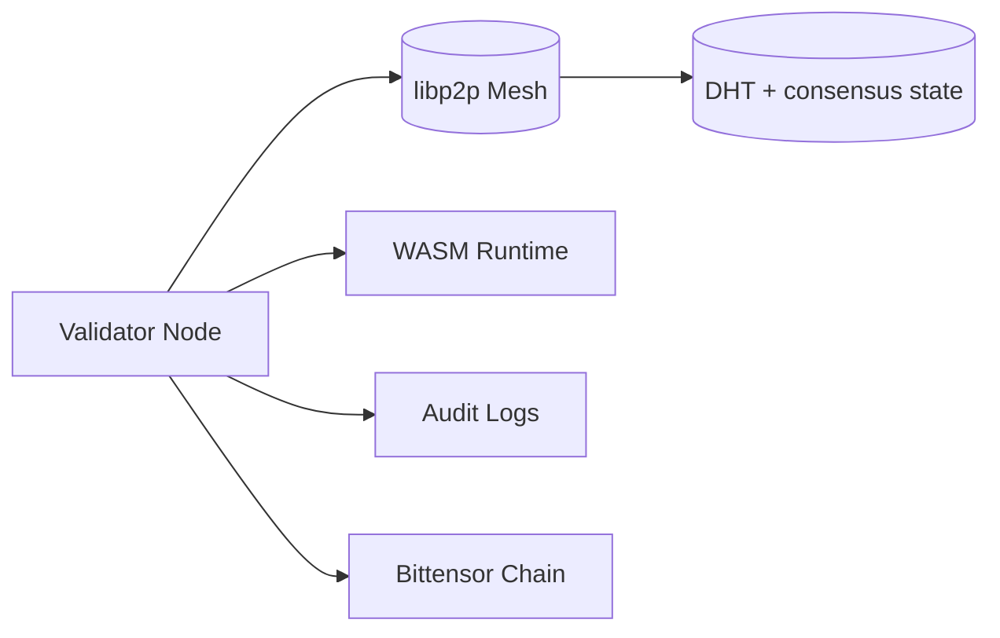
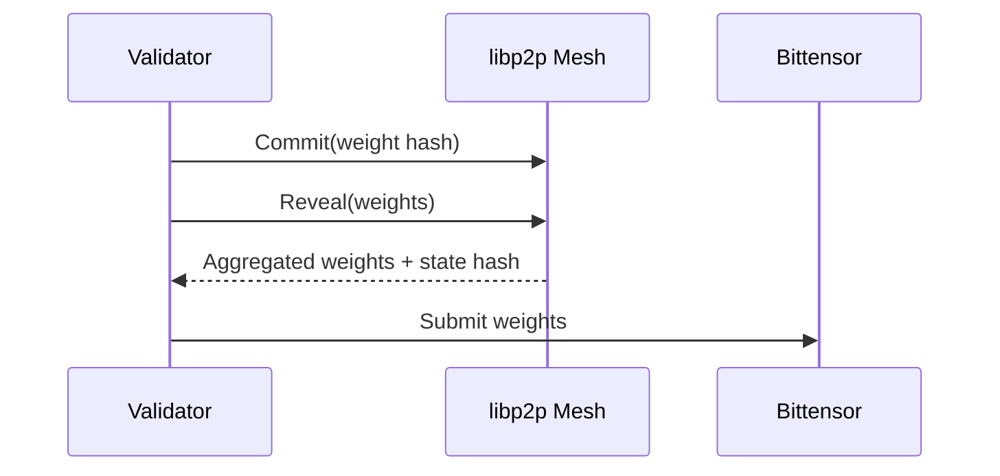

# Validator Operations

This guide covers validator deployment, configuration, monitoring, and lifecycle operations.

## Quick Start with Docker Compose

```bash
# Clone repository
git clone https://github.com/PlatformNetwork/platform.git
cd platform

# Configure environment
cp .env.example .env
nano .env  # Set VALIDATOR_SECRET_KEY to your BIP39 mnemonic

# Start validator
docker compose up -d

# View logs
docker compose logs -f validator

# Stop validator
docker compose down
```

## Production Deployment

For production, we recommend running the validator with auto-updates enabled:

```bash
# Start with Watchtower for auto-updates
docker compose up -d

# Watchtower will automatically pull new images every 5 minutes
# and restart the validator with zero downtime
```

## Operational Topology



## Requirements

### Hardware

| Resource | Minimum | Recommended |
| --- | --- | --- |
| CPU | 4 vCPU | 8 vCPU |
| RAM | 16 GB | 32 GB |
| Storage | 250 GB SSD | 500 GB NVMe |
| Network | 100 Mbps | 100 Mbps |

### Network

| Port | Protocol | Usage | Required |
| --- | --- | --- | --- |
| 9000/tcp | libp2p | Validator P2P mesh | Yes |
| 8545/tcp | HTTP | JSON-RPC API | Optional |

### Bittensor

- Minimum stake: 1000 TAO.
- Registered hotkey on subnet.
- BIP39 mnemonic or hex private key.

## Configuration

### Environment Variables (.env file)

Create a `.env` file in the project root with your configuration:

```bash
# Required: Your validator hotkey mnemonic (24 words)
VALIDATOR_SECRET_KEY=word1 word2 word3 word4 word5 word6 word7 word8 word9 word10 word11 word12 word13 word14 word15 word16 word17 word18 word19 word20 word21 word22 word23 word24

# Optional: Network configuration
NETUID=100
SUBTENSOR_ENDPOINT=wss://entrypoint-finney.opentensor.ai:443

# Optional: Port configuration
RPC_PORT=8080
P2P_PORT=8090

# Optional: Logging
RUST_LOG=info,validator_node=debug
```

### Full Environment Reference

| Variable | Description | Default | Required |
| --- | --- | --- | --- |
| `VALIDATOR_SECRET_KEY` | BIP39 mnemonic (24 words) | - | **Yes** |
| `SUBTENSOR_ENDPOINT` | Bittensor RPC endpoint | `wss://entrypoint-finney.opentensor.ai:443` | No |
| `NETUID` | Subnet UID | `100` | No |
| `RPC_PORT` | JSON-RPC API port | `8080` | No |
| `P2P_PORT` | libp2p P2P port | `8090` | No |
| `BOOTNODE_PORT` | Bootnode port (if WITH_BOOTNODE=true) | `8090` | No |
| `WITH_BOOTNODE` | Run integrated bootnode | `false` | No |
| `BOOTSTRAP_PEERS` | Bootstrap peer multiaddrs | Auto-discovered | No |
| `RUST_LOG` | Log level | `info` | No |
| `EXTERNAL_IP` | Public IP for P2P announcements | Auto-detected | No |

### Security Notes

- Store `.env` with restricted permissions: `chmod 600 .env`
- Never commit `.env` to version control
- Use Docker secrets or a secret manager in production

## Consensus & Epoch Timeline



## Monitoring

### Logs

```bash
# Follow validator logs
docker compose logs -f validator

# View last 100 lines
docker compose logs --tail=100 validator

# Check all services
docker compose logs -f
```

### Container Status

```bash
# Check running containers
docker compose ps

# Resource usage
docker stats platform-validator

# Inspect container
docker inspect platform-validator
```

### JSON-RPC Health Check

```bash
curl -s -X POST http://localhost:8080/rpc \
  -H "Content-Type: application/json" \
  -d '{"jsonrpc":"2.0","method":"system_health","id":1}' | jq
```

Expected response:

```json
{
  "jsonrpc": "2.0",
  "result": {
    "peers": 5,
    "isSyncing": false,
    "shouldHaveWeights": true
  },
  "id": 1
}
```

### Useful RPC Commands

```bash
# List validators
curl -s -X POST http://localhost:8080/rpc \
  -H "Content-Type: application/json" \
  -d '{"jsonrpc":"2.0","method":"validator_list","id":1}' | jq

# List challenges
curl -s -X POST http://localhost:8080/rpc \
  -H "Content-Type: application/json" \
  -d '{"jsonrpc":"2.0","method":"challenge_list","id":1}' | jq

# Get peer info
curl -s -X POST http://localhost:8080/rpc \
  -H "Content-Type: application/json" \
  -d '{"jsonrpc":"2.0","method":"p2p_peers","id":1}' | jq
```

## Operations Playbooks

### Upgrade

With Watchtower enabled (default in docker-compose.yml), upgrades happen automatically every 5 minutes.

Manual upgrade:

```bash
# Pull latest image
docker compose pull

# Restart with new image
docker compose up -d
```

### Restart Validator

```bash
# Graceful restart
docker compose restart validator

# Full restart (recreate container)
docker compose up -d --force-recreate validator
```

### Reset State (After Divergence)

```bash
# Stop validator
docker compose down

# Remove persistent data
docker volume rm platform_validator-data

# Restart fresh
docker compose up -d
```

### Stop Validator

```bash
# Stop all services
docker compose down

# Stop and remove volumes (full reset)
docker compose down -v
```

### View Validator Hotkey

```bash
# Get your validator's hotkey from the mnemonic
docker compose exec validator /app/utils hotkey-from-mnemonic "$VALIDATOR_SECRET_KEY"
```

## Testing

Run the comprehensive test suite (Docker is only needed for the optional multi-validator compose phase):

```bash
./scripts/test-comprehensive.sh
```

## Troubleshooting

### No Peers Connected

```bash
# Check P2P port is open
nc -zv your-server-ip 8090

# Verify firewall rules
sudo ufw status

# Check logs for P2P errors
docker compose logs validator | grep -i "peer\|connect\|p2p"
```

- Ensure port `8090/tcp` is reachable from the public internet
- Check that `EXTERNAL_IP` is set correctly if behind NAT

### Bittensor Connection Issues

```bash
# Test Bittensor endpoint
curl -I wss://entrypoint-finney.opentensor.ai:443

# Try alternative endpoint in .env:
SUBTENSOR_ENDPOINT=wss://subtensor.api.opentensor.ai:443
```

### Container Won't Start

```bash
# Check container logs
docker compose logs validator

# Verify .env file exists and has correct format
cat .env

# Check Docker resources
docker system df
```

### WASM Execution Errors

```bash
# Check WASM-related logs
docker compose logs validator | grep -i "wasm\|challenge"

# Verify challenge is loaded
curl -s -X POST http://localhost:8080/rpc \
  -H "Content-Type: application/json" \
  -d '{"jsonrpc":"2.0","method":"challenge_list","id":1}' | jq
```

## Security Best Practices

- Restrict `.env` permissions: `chmod 600 .env`
- Never commit `.env` to version control (add to `.gitignore`)
- Use a firewall and limit ingress to required ports (8080, 8090)
- Monitor logs for anomalies
- Keep Docker and the host system updated
- Use Docker secrets in production environments

## References

- [Architecture](../architecture.md)
- [Security Model](../security.md)
- [Validator Guide](../validator.md)
